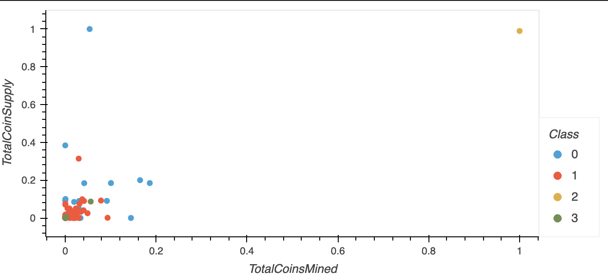

- [Crypto Research with Unsupervised ML](#org2ff9e6a)
  - [Overview](#org0630a75)
  - [Results](#orgb42d796)
  - [Summary](#orgee3d1d3)


<a id="org2ff9e6a"></a>

# Crypto Research with Unsupervised ML


<a id="org0630a75"></a>

## Overview

In this analysis, we managed to find classes for a collection of cryptocurrencies using K-means clustering. We went for this approach because we needed help on making sense of the data as there was not a clear way to classify it from the start. The data is also multidimensional so we needed to apply Principal Component Analysis for improving our model&rsquo;s performance.


<a id="orgb42d796"></a>

## Results

We went through the K-means process, starting with plotting an Elbow curve for finding the best number of clusters.

We can create a function for using in other datasets.

```python
def get_elbow_curve_df(df: pd.DataFrame, range_: range = range(1, 10), random_state: int = 0) -> pd.DataFrame:
    """Returns a DataFrame with the resulting ks and inertia values
    for plotting an elbow curve. It uses the KMeans from sklearn.cluster.
    range_ defaults to 1 to 10.
    random_state defaults to 0."""
    return pd.DataFrame(
        {
            "k": range_,
            "inertia": [
                KMeans(n_clusters=k, random_state=random_state)
                .fit(df)
                .inertia_
                for k in range_
            ]
        }
    )
df_elbow = get_elbow_curve_df(pcs_df)
df_elbow.hvplot.line(x="k", y="inertia", title="Elbow Curve", xticks="k")
```


Then we created our model with 4 clusters and made a prediction.

```python
model = KMeans(n_clusters=4, random_state=42).fit(pcs_df)
y_pred = model.fit_predict(pcs_df)
```

Then we merge the results with our dataframe.


Finally we created visualizations for our clusters. In the first one we manage to see the PCA values which have no meaning in relation to the data but they help us get an expression of the data in less dimensions.


Then we will create a 2D graph based on `TotalCoinsMined` and `TotalCoinSupply` and group it by `class`, which are our clusters.




<a id="orgee3d1d3"></a>

## Summary

The clusters help us understand the nature of the dataset and help us visualize the outliers and the different kinds of crypto coins in existence. With these results we can proceed with more confident in our research and possibly comnbine it with a few more steps before making use of the information but this is a great start for making sense of the data.
